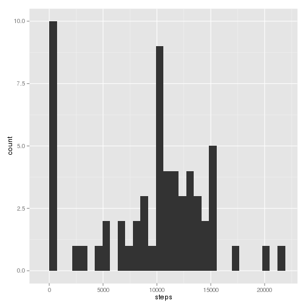
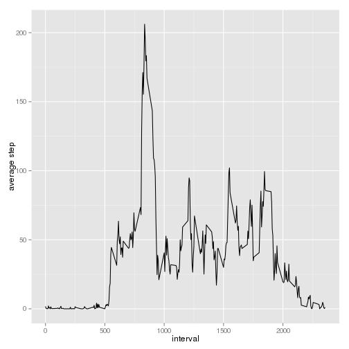
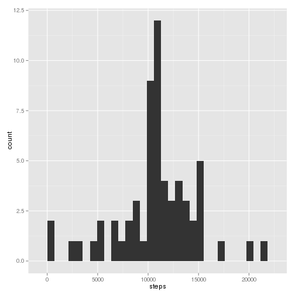
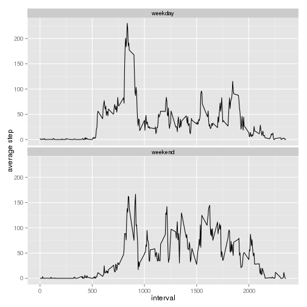

---
title: "Reproducible Research: Peer Assessment 1"
output: 
  html_document:
    keep_md: true
---


## Loading and preprocessing the data


1. Load the data


```r
dataset <- read.csv(file = unz("./activity.zip","activity.csv"))
```

2. Process/transform the data (if necessary) into a format suitable for your analysis

> Not required


## What is mean total number of steps taken per day?

1. Calculate the total number of steps taken per day. Missing values in dataset are ignored.


```r
steps_per_day <- dataset %>% group_by(date) %>% summarize(total_steps = sum(steps, na.rm = TRUE))
```

2. Histogram of the total number of steps taken each day


```r
g <- ggplot(data=steps_per_day, aes(total_steps))
p <- g + geom_histogram() + xlab("steps")
print(p)
```

 

3. The mean and median of the total number of steps taken per day


```r
mm <- c(mean=mean(steps_per_day$total_steps), median=median(steps_per_day$total_steps))
print(mm)
```

```
##     mean   median 
##  9354.23 10395.00
```

## What is the average daily activity pattern?

1. Make a time series plot of the 5-minute interval (x-axis) and the average number of steps taken, averaged across all days (y-axis)


```r
g <- ggplot(data=steps_mean_per_interval, aes(interval, mean_steps))
p <- g + geom_line() + ylab("average step")
print(p)
```

 

2. Which 5-minute interval, on average across all the days in the dataset, contains the maximum number of steps?


```r
top_interval <- steps_mean_per_interval[which.max(steps_mean_per_interval$mean_steps),]
print(top_interval)
```

```
## Source: local data frame [1 x 2]
## 
##   interval mean_steps
## 1      835   206.1698
```


## Imputing missing values

1. Calculate and report the total number of missing values in the dataset


```r
na <- c(total_na = sum(is.na(dataset$steps)), total_na_days = length(unique(subset(dataset, is.na(dataset$steps))$date)))
print(na)
```

```
##      total_na total_na_days 
##          2304             8
```

2. Devise a strategy for filling in all of the missing values in the dataset. We will use this function:


```r
steps_mean_by_interval <- function(data, inter) {
    result <- round(mean(subset(data, data$interval==inter)$steps, na.rm = TRUE))
    return(result)
}
```
3. Create a new dataset (`dataset_no_na`) that is equal to the original dataset but with the missing data filled in.


```r
idx <- which(is.na(dataset$steps))
dataset_no_na <- dataset
for (i in idx) {
    dataset_no_na[i,"steps"] <- steps_mean_by_interval(dataset, dataset_no_na[i,"interval"])
}
```

4. Make a histogram of the total number of steps taken each day and Calculate and report the mean and median total number of steps taken per day.


```r
steps_per_day_no_na <- dataset_no_na %>% group_by(date) %>% summarize(total_steps = sum(steps))
g <- ggplot(data=steps_per_day_no_na, aes(total_steps))
p <- g + geom_histogram() + xlab("steps")
print(p)
```

 

- Do these values differ from the estimates from the first part of the assignment?

> Yes, days with no values where filled and now are those report in the middle parte of the histogram.

- What is the impact of imputing missing data on the estimates of the total daily number of steps?

> In this case there is no major impact because the rest of the distribution remains.

## Are there differences in activity patterns between weekdays and weekends?

1. Create a new factor variable in the dataset with two levels – “weekday” and “weekend” indicating whether a given date is a weekday or weekend day.


```r
dataset_no_na$day[weekdays(as.Date(dataset_no_na$date,"%Y-%m-%d"), abbreviate = TRUE) %in% c("Sat","Sun")] <- "weekend"
dataset_no_na$day[!weekdays(as.Date(dataset_no_na$date,"%Y-%m-%d"), abbreviate = TRUE) %in% c("Sat","Sun")] <- "weekday"
dataset_no_na$day <- as.factor(dataset_no_na$day)
```

2. Make a panel plot containing a time series plot of the 5-minute interval (x-axis) and the average number of steps taken, averaged across all weekday days or weekend days (y-axis).


```r
steps_mean_per_interval_day_type <- dataset_no_na %>% group_by(day,interval) %>% summarize(mean_steps = mean(steps, na.rm = TRUE))
g <- ggplot(data=steps_mean_per_interval_day_type, aes(interval, mean_steps))
p <- g + geom_line() + ylab("average step") + facet_wrap(~day, ncol=1)
print(p)
```

 
